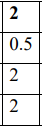
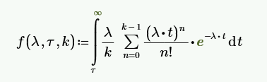
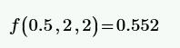
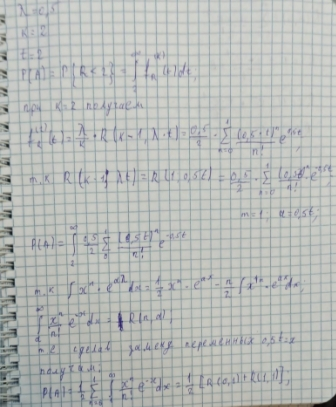
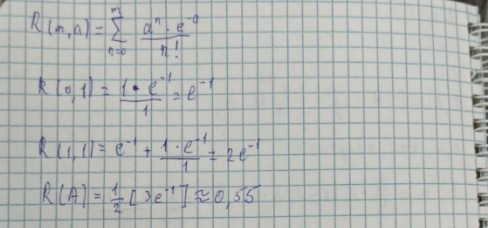


# Содержание
[Задача	3](#_Toc66219604)

[Решение с помощью системы MathCAD	4](#_Toc66219605)

[Решение с помощью программного пакета GPSS	5](#_Toc66219606)

[Решение вручную с помощью подстановки	6](#_Toc66219607)

[Вывод](#_Toc66219608)


# **Задача**
`	`*Вариант №2.*

Интервал T между последовательными сбоями ЭВМ, устраняемыми практически мгновенно с помощью программных средств, имеет распределение Эрланга 2- го порядка с параметром l = 0.5 (1/час). Для решения задачи требуется работа ЭВМ без сбоев в течение 2 часов. Задачу начинаем решать в произвольный момент t , никак не связанный с потоком сбоев. 

Найти вероятность события: A = {задача будет решена с первого раза}.

(Вероятность безотказной работы).



Рисунок 1 – начальные данные


# **Решение с помощью системы MathCAD** 
Для того, чтобы решить задачу в системе MathCAD, нам необходимо в интеграл (рис. 2) подставить наши входные данные.

Входные данные: τ = 2; λ = 0.5; k = 2. Решение на рисунке 3.

Вероятность безотказной работы = 0.522.



Рисунок 2 – Интеграл



Рисунок 3 – Решение


# **Решение с помощью программного пакета GPSS**
`	`Нижи представлен код программы имитационного моделирования, с помощью которой были вычислены хорошие транзакции. Узнав хорошее число транзакций и разделив на общее количество заявок (100000), мы узнаем вероятность безотказной работы.

`	`Входные данные: τ = 2 λ = 0.5; k = 2. Решение на рисунке 4.

`	`Кол-во хороших транзакций = 55454. Общее количество = 100000.

`	`Вероятность безотказной работы = 55454/100000 = **0.** **55454**.

```
rmult 111

ex FUNCTION RN1,c24

`        `0,0/.1,.104/.2,.222/.3,.355/.4,.509/.5,.69/.6,.915

`        `.7,1.2/.75,1.38/.8,1.6/.84,1.85/.88,2.12/.9,2.3

`        `.92,2.52/.94,2.81/.95,2.99/.96,3.2/.97,3.5/.98,3.9

`        `.99,4.6/.995,5.3/.998,6.2/.999,7/.9998,8

num fvariable N$GO@2

time fvariable p2-p1


`	`GENERATE	360,120

`	`SEIZE	comp		

`	`ADVANCE	120	

`	`RELEASE	comp

good 	TERMINATE 1	

`	`GENERATE	120,fn$ex

GO	ADVANCE	1	

`	`TEST E	V$num,0,ter	

`	`PREEMPT	comp,,away,,re

`	`RETURN	comp	

ter	TERMINATE	

away 	terminate 1


start 100000
```


Рисунок 4 – Работа программы
# **Решение вручную с помощью подстановки**
Событие A состоит в том, что с.в. R - время, оставшееся до очередного сбоя, принимает значение больше 2-х часов.



Рисунок 5.1 – Решение вручную



Рисунок 5.2 – Решение вручную

`	`Вероятность безотказной работы = 0.55.
\*

# **Вывод**
В результаты решения задачи разными способами, мы выяснили вероятность безотказной работы = 0.55. Так же решая задачу с помощью разных методов мы получили одинаковый ответ, следовательно все методы были правильно реализованы.