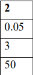



# Содержание
[Задача](#_Toc128327637)

[Решение задачи](#_Toc128327638)

[Вывод](#_Toc128327639)

# **Задача**
`	`*Вариант №2.*

Дана вычислительная система с холодным резервированием. Резервирование двукратное: одна ЭВМ - рабочая, две – резервные (s = 3). Среднее время наработки одной ЭВМ на отказ – 20 часов (интенсивность отказов λ = 0.05 (1\час). Определить вероятность того, что система является работоспособной через 50 часов после включения (в начале работы все ЭВМ исправны).

Рисунок 1 – начальные данные

# **Решение задачи:** 
\1. Вероятность безотказной работы системы с холодным резервированием определяется выражением:

Pрезt=e-λtk=0s-1λtkk!

Вычисляем Р(50) в средеMathCAD: 

Рисунок 1 – Зависимость вероятности безотказной работы 
системы от времени

Зависимость вероятности безотказной работы системы от времени представлена на рис. 1 и при t=50 равна 0.544.

\2. Решение задачи численным методом 

Используем возможности среды MathCAD для нахождения решения системы ДУ:

P0'(t)=-λP0(t)
P1'(t)=-λP1(t)+λP0(t)
..........................
Pn'(t)=-λPn(t)+λPn-1(t)
..........................
Ps'(t)=λPs-1(t)

Рисунок 2 – Матрица P

Решение задачи дается в виде матрицы Р, в первом столбце которой приведены значения времени (на рисунке 2 показано решение задачи для моментов времени от 0 до 100 часов c шагом в 10 часов). Пятый столбец содержит значения вероятностей нахождения системы в состоянии Ps, в котором система неисправна (все ЭВМ вышли из строя). Ps50=0,456, а вероятность исправной работы системы в момент времени t=50, таким образом, равна 1-0,456=0,544, что полностью совпадает с полученным в пункте 1 результатом (Рис. 1).

Для получения зависимости исправной работы системы от времени необходимо выполнить следующие действия:

Рисунок 3 – Зависимость вероятности безотказной работы системы от времени, полученная численным решением системы уравнений Колмогорова

В результате мы можем наблюдать полное совпадение рисунков 1 и 3.

\3. Решение задачи методом имитационного моделирования.

Код программы на GPSS:

Рисунок 4 – Код программы

Ниже приведены результаты работы программы:

Рисунок 5 – Отчет по работе программы

Из результатов видно, что через блок TEST прошло 100000 транзактов, т.е. было проведено соответствующее число проверок состояния системы в момент T=50. Из них 54430 закончились успешно (система была работоспособна). Следовательно, вероятность нахождения системы в исправном состоянии в момент T=50 равна 0. 54430. 
\*

# **Вывод**
В результаты решения задачи разными способами, мы выяснили вероятность безотказной работы = 0.54430. Так же решая задачу с помощью разных методов мы получили одинаковый ответ, следовательно все методы были правильно реализованы.
